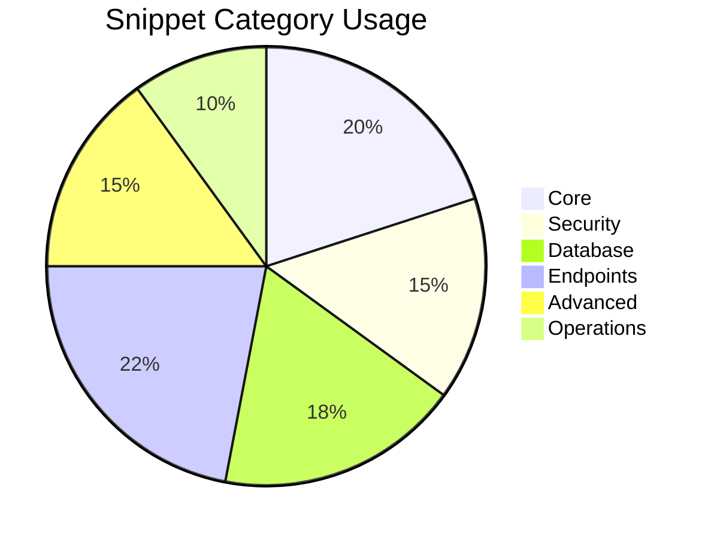

# 🚀 Ultimate FastAPI Snippets Collection


> Accelerate your FastAPI development with 50+ production-ready code snippets covering everything from authentication to deployment!

## 🌟 Features

- **50+ meticulously crafted snippets** for FastAPI development
- **Production-ready patterns** following best practices
- **Comprehensive coverage** of essential FastAPI features
- **Time-saving templates** for common development tasks
- **Regularly updated** with new patterns and optimizations


## 🧩 Snippet Categories

| Category | Snippets | Description |
|----------|----------|-------------|
| **⚡ Core** | `fastimp`, `fastapp`, `fastrouter` | Essential imports, app instance, routers |
| **🔒 Security** | `fastsecurity`, `fastoauth`, `fastroles` | Authentication, OAuth2, RBAC |
| **💾 Database** | `fastdb`, `fastsqla`, `fastasyncdb` | SQLAlchemy models, async DB connections |
| **📡 Endpoints** | `fastget`, `fastpost`, `fastupload` | REST endpoints, file uploads |
| **🚀 Advanced** | `fastws`, `fastcache`, `fastemail` | WebSockets, Redis caching, background emails |
| **🛠️ Operations** | `fasthealth`, `fastlog` | health checks, logging |
| **🧪 Testing** | `fasttest`, `fastexcept` | Test clients, custom exceptions |

## 🚀 Top 10 Most Useful Snippets

1. **`fastsecurity`** - Complete JWT authentication setup
   ```python
   # Password hashing
   pwd_context = CryptContext(schemes=["bcrypt"], deprecated="auto")

   # JWT Configuration
   SECRET_KEY = "your-secret-key"
   ALGORITHM = "HS256"
   ACCESS_TOKEN_EXPIRE_MINUTES = 30
   ```

2. **`fastcrud`** - Full CRUD operations template
   ```python
   @router.get("/", response_model=List[Model])
   def read_items(db: Session = Depends(get_db)):
       return db.query(Model).all()
   ```

3. **`fastcache`** - Redis caching implementation
   ```python
   @app.on_event("startup")
   async def startup():
       redis = aioredis.from_url("redis://localhost")
       FastAPICache.init(RedisBackend(redis), prefix="fastapi-cache")

   @app.get("/cached-data/")
   @cache(expire=60)
   async def get_cached_data():
       return {"data": "expensive to compute"}
   ```

4. **`fastlimit`** - API rate limiting
   ```python
   limiter = Limiter(key_func=get_remote_address)
   app.state.limiter = limiter

   @app.get("/limited/")
   @limiter.limit("5/minute")
   async def limited_route(request: Request):
       return {"message": "Rate limited endpoint"}
   ```

5. **`fastemail`** - Background email sending
   ```python
   async def send_welcome_email(email: str):
       message = MessageSchema(
           subject="Welcome!",
           recipients=[email],
           body="<strong>Thanks for joining!</strong>",
           subtype="html"
       )
       await fm.send_message(message)
   ```

6. **`fastasyncdb`** - Async database connection
   ```python
   database = Database(DATABASE_URL)

   @app.on_event("startup")
   async def startup():
       await database.connect()

   @app.get("/async-items/")
   async def read_async_items():
       return await database.fetch_all("SELECT * FROM items")
   ```

7. **`fastresponse`** - High-performance ORJSON response
   ```python
   @app.get("/custom-response/", response_class=ORJSONResponse)
   async def custom_response():
       return ORJSONResponse(
           content={"message": "Faster JSON response"},
           headers={"X-Custom-Header": "value"}
       )
   ```

8. **`fastbroadcast`** - WebSocket broadcast manager
   ```python
   class ConnectionManager:
       def __init__(self):
           self.rooms: dict = defaultdict(dict)

       async def broadcast(self, room: str, message: str):
           for connection in self.rooms[room].values():
               await connection.send_text(message)
   ```

9. **`fastlog`** - Professional logging configuration
    ```python
    LOGGING_CONFIG = {
        "version": 1,
        "formatters": {"standard": {"format": "%(asctime)s [%(levelname)s] %(name)s: %(message)s"}},
        "handlers": {"console": {"class": "logging.StreamHandler", "formatter": "standard"}},
        "loggers": {"": {"handlers": ["console"], "level": "INFO"}}
    }
    ```
10. **`fastsqla`** - SQLAlchemy database setup
	```python
	from sqlalchemy import create_engine
    from sqlalchemy.ext.declarative import declarative_base
    from sqlalchemy.orm import sessionmaker

    SQLALCHEMY_DATABASE_URL = \"${1:sqlite:///./test.db}\"

    engine = create_engine(
          SQLALCHEMY_DATABASE_URL,
          connect_args={\"check_same_thread\": False}  # SQLite only",
    ),
    SessionLocal = sessionmaker(autocommit=False, autoflush=False, bind=engine),
    Base = declarative_base()
	```

## 📊 Snippet Usage Statistics



## 🛠️ Customization Tips

1. **Personalize Placeholders** - Replace all `${...}` variables with your specific values
   ```python
   app = FastAPI(
       title="My Awesome API",  # ← Change this
       version="1.0.0"         # ← And this
   )
   ```

2. **Combine Snippets** - Create powerful combinations:
   - `fastsecurity` + `fastroles` = Full authentication with RBAC
   - `fastdb` + `fastcrud` = Complete database workflow
   - `fastcache` + `fastasyncdb` = High-performance data layer

3. **Extend for Your Needs** - Use snippets as foundations for custom implementations:
   ```python
   # Original
   @cache(expire=60)

   # Extended with custom key
   @cache(expire=300, key_builder=custom_key_builder)
   ```

## 🤝 Contribution Guidelines

We welcome contributions! Here's how to help:

1. Fork the repository
2. Create a new branch (`git checkout -b feature/new-snippet`)
3. Add your snippet to `snippets.json`
4. Update the README if needed
5. Submit a pull request

**Snippet Requirements:**
- Must solve a common FastAPI problem
- Follow FastAPI best practices
- Include proper documentation
- Have a unique prefix starting with "fast"

## 📜 License

This project is licensed under the MIT License - see the [LICENSE](LICENSE) file for details.

---

<div align="center">
  <br>
  <strong>Happy Coding! 🐍⚡</strong>
</div>
